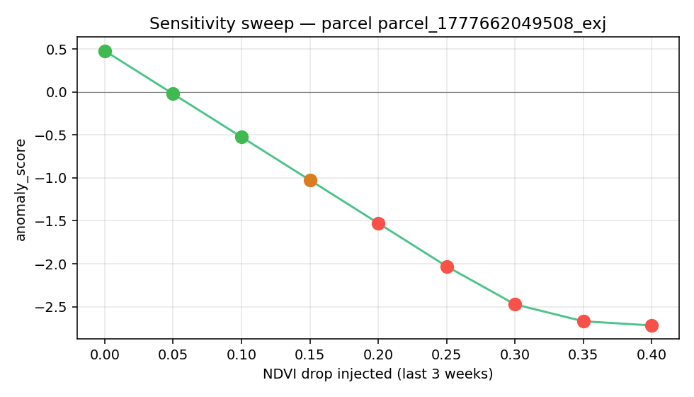

# EZZAYRA Olive Anomaly Detector - Validation Report

## Test 1: Temporal holdout (train < 2024-01-01, test >= 2024-01-01)

- **Parcels evaluated**: 49
- **R^2**: mean=+0.096, median=+0.361, min=-5.224, max=+0.749
- **RMSE**: mean=0.043 NDVI units
- **MAE**: mean=0.033 NDVI units

## Test 2: Drought-year replay (target = Sept 30 each year)

| Year | vert | orange | rouge | % flagged |
|------|------|--------|-------|-----------|
| 2020 | 32 | 11 | 6 | 34.7% |
| 2021 | 45 | 4 | 0 | 8.2% |
| 2022 (FAO: worst Tunisia drought in 70y) | 36 | 13 | 0 | 26.5% |
| 2023 | 47 | 2 | 0 | 4.1% |
| 2024 | 48 | 1 | 0 | 2.0% |

## Test 3: Synthetic stress sensitivity

- Reference parcel: `parcel_1777662049508_exj14`
- First orange triggered at NDVI drop = 0.15
- First rouge triggered at NDVI drop = 0.2
- Chart: 

| drop | score | statut |
|------|-------|--------|
| 0.00 | +0.48 | vert |
| 0.05 | -0.02 | vert |
| 0.10 | -0.52 | vert |
| 0.15 | -1.03 | orange |
| 0.20 | -1.53 | rouge |
| 0.25 | -2.03 | rouge |
| 0.30 | -2.47 | rouge |
| 0.35 | -2.67 | rouge |
| 0.40 | -2.72 | rouge |

## Test 4: Spatial clustering of 2022 alerts

- Flagged parcels: **13**
- Mean nearest-neighbor distance among alerts: **11.09 km**
- Mean NN distance for random samples of same size: **18.57 km**
- Clustering ratio: **0.60** (<1 = clustered, =1 = random)
- Empirical p-value: **0.132**

## Interpretation

- The regression has weak predictive power on held-out data — anomaly detection should be interpreted cautiously.